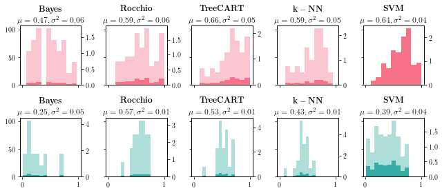

# Reproduction of Text Categorization with SVMs

**Paper:** Text Categorization with Support Vector Machines: Learning with Many Relevant Features 
**Source:** https://dl.acm.org/citation.cfm?id=649721

The paper suggests the suitability of Support Vector Machines for text classification purposes. In this jupyter notebook I tried to reproduce the results obtained in the paper.

**Datasets:**
- Reuters: http://disi.unitn.it/moschitti/corpora/Reuters21578-Apte-90Cat.tar.gz     
- Ohsumed: http://disi.unitn.it/moschitti/corpora/ohsumed-first-20000-docs.tar.gz

Unzip the datasets into a directory called `./datasets`

**Note:** This notebook needs a Python 2 kernel because of the svmlight package and if you don't want to do the training yourself the results are stored in `./results.tar.gz`
